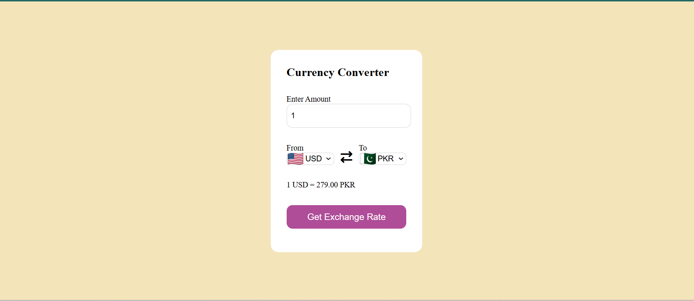

# 💱 Currency Converter

A simple currency converter web app that converts between different currencies using real-time exchange rates.

## 🚀 Features

- Convert between multiple currencies
- Default conversion: USD → PKR
- Real-time exchange rates (EUR-based API)
- Country flags for each currency

## 🛠️ Tech Used

- HTML
- CSS
- JavaScript (Fetch API)

## 📦 API Used

## 📦 API Used

https://latest.currency-api.pages.dev/v1/currencies/eur.json

## ▶️ How to Run

1. Clone the repository
2. Open `index.html` in your browser

## 📸 Preview

## 📌 Note

This project uses EUR as base currency and performs manual conversion between currencies.

---

Made by Muhammad Awais khan🚀
